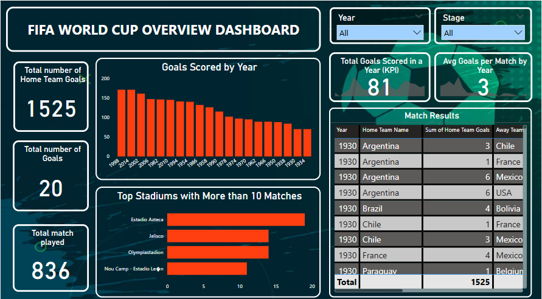
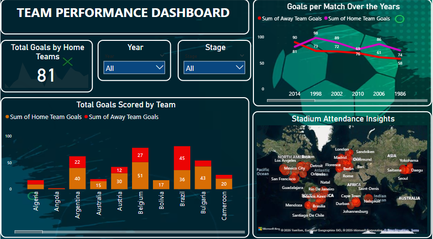

# ⚽ FIFA World Cup Power BI Dashboard Analysis

This project explores FIFA World Cup data using two interactive dashboards developed in Power BI. The analysis focuses on match goals, team performance, stadium statistics, and overall tournament trends.

## 📁 Datasets Used

- `WorldCupMatches.csv` – Contains match-level details (teams, goals, stadiums, years, etc.)
- `WorldCups.csv` – Summarises each tournament’s overall data (winners, attendance, etc.)
- `WorldCupPlayers.csv` – Contains information on players and participation

## 🛠️ Tools Used

- Power BI Desktop
- Power Query Editor
- DAX (Data Analysis Expressions)

---

## 📊 Dashboard 1: **Team Performance Dashboard**

This dashboard provides a deep dive into the performance of home and away teams across different FIFA World Cup matches. It includes:

- **Total Goals by Home Teams** – A KPI card showing the cumulative goal count for home teams.
- **Year and Stage Filters** – Dynamic slicers to filter the data.
- **Total Goals Scored by Team** – Clustered bar chart comparing home vs away goals team-wise.
- **Goals Per Match Over the Years** – Line graph comparing average goals from home and away teams over time.
- **Stadium Attendance Insights** – A map visual showing hotspots where matches were held and crowds gathered.

### 🖼️ Team Performance Dashboard Preview

---

## 📊 Dashboard 2: **FIFA World Cup Overview Dashboard**

This dashboard offers a macro-level view of FIFA World Cup tournament data. It presents:

- **Total Number of Home Team Goals** – Displays the cumulative home team goal count.
- **Total Number of Goals** – Total number of goals in the selected year or stage.
- **Total Matches Played** – Gives an overview of how many matches have been played.
- **Goals Scored by Year** – Bar chart showing how many goals were scored in each World Cup year.
- **Top Stadiums with More Than 10 Matches** – Identifies key stadiums that hosted many matches.
- **Match Results Table** – Shows historical match outcomes by year, home team, and away team with scores.
- **KPI Cards** – Indicating total goals in a selected year and average goals per match.

### 🖼️ Overview Dashboard Preview

---

## 🧠 Insights Gained

- Brazil and Belgium consistently scored high as home and away teams.
- Average goals per match have fluctuated over the years, with peaks in certain years like 2014.
- Stadiums in Mexico (like Estadio Azteca) have hosted the most matches.
- Attendance and performance patterns vary by region and era.

---

